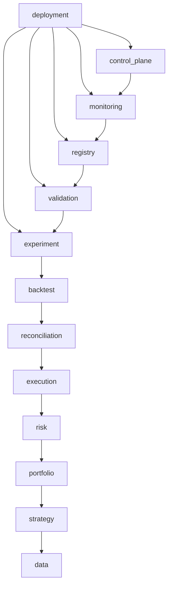

# Architecture

## Purpose

This document defines the intended boundaries for the autonomous trading vertical slice. It is a
design constraint, not evidence that every component already exists.

The architecture must implement the safety rules in `TRADING_MANDATE.md` and the engineering rules
in `AGENTS.md`.

## System boundary

The initial system accepts versioned configuration and synthetic or explicitly approved historical
market data. It may produce research artifacts, backtest results, independent validation reports,
and simulated paper-trading records.

It has no live-broker boundary, no real-capital boundary, and no deployment authority.

## Intended flow

```text
versioned data + configuration
              |
              v
      strategy generation
              |
           signals
              |
              v
     target portfolio engine
              |
       proposed targets
              |
              v
      independent risk gate
              |
     approved paper intent
              |
              v
       paper broker simulator
              |
              v
   accounting + reconciliation
              |
              v
 audit, monitoring, and evidence
```

Independent validation consumes immutable experiment inputs and outputs through a separate path. It
does not trust strategy-authored claims and cannot be bypassed by the strategy pipeline.

## Planned component boundaries

| Area | Responsibility | Must not |
| --- | --- | --- |
| configuration | Load typed, versioned, fail-closed settings | Infer permissive defaults |
| audit | Record append-only domain and control events | Rewrite historical events |
| data | Represent and validate canonical market data | Hide timestamp or quality defects |
| strategy | Produce signals from information available at decision time | Approve itself or place orders |
| backtest | Run chronology-safe deterministic simulations | Read future data |
| portfolio | Convert signals into proposed target positions | Bypass risk controls |
| validation | Independently challenge experiments and promotion evidence | Depend on strategy approval logic |
| risk | Reject or constrain proposed paper actions | Be overridden by strategy code |
| execution | Simulate idempotent paper order lifecycles | Route to a live venue |
| reconciliation | Compare expected and observed simulated state | Continue activity after material mismatch |
| control plane | Expose read-only status and audited simulator controls | Enable live trading |

## Dependency direction

Domain schemas and deterministic utilities belong at the centre. Higher-level orchestration may
depend on lower-level domain interfaces, but domain code must not depend on UI, deployment, or
external adapters.

Strategy packages must not import execution adapters. Validation must operate through immutable
artifacts and stable interfaces rather than strategy internals. Risk and reconciliation must remain
independently invocable and testable.

The principal dependency flow is:



Arrows mean "may import". The diagram is intentionally simplified; the table below is the exact
direct-import policy enforced by `scripts/check_import_boundaries.py`.

## Enforced package contracts

Cross-package imports must use symbols exported by the target package's `__init__.py`. Importing
another package's internal modules is prohibited. At BUB-7 completion these public package roots are
present but intentionally export no runtime symbols; the owning implementation ticket must add a
typed, versioned public contract before another package can consume it.

The root `autonomous_trading` package may expose repository metadata such as `__version__`, but it
must not re-export component symbols. Dynamic imports are prohibited in boundary-controlled source
because they would bypass deterministic static dependency enforcement.

Unless a row is marked implemented, its public contract remains planned future work.

| Package | Owner and responsibility | Allowed direct package imports | Public contract |
| --- | --- | --- | --- |
| `configuration` | Platform configuration; typed, versioned, fail-closed settings | none | Implemented: immutable schemas, strict TOML loaders, and content-addressed snapshots |
| `audit` | Audit integrity; append-only attributable events | none | Implemented: versioned immutable events, canonical integrity evidence, and append-only replay |
| `data` | Data integrity; canonical records and approved local access | none | Market-data records, quality results, and reader protocols |
| `strategy` | Strategy authors; chronology-safe signal generation only | `data` | Signal-generation protocols and signal records |
| `portfolio` | Portfolio construction; signals to proposed targets | `data`, `strategy` | Proposed target and portfolio-state contracts |
| `risk` | Independent risk controls; approve, constrain, or reject paper intent | `audit`, `configuration`, `data`, `portfolio` | Risk decisions and approved paper intent |
| `execution` | Paper execution; deterministic idempotent simulation only | `audit`, `configuration`, `portfolio`, `risk` | Simulated order commands and lifecycle events |
| `reconciliation` | Independent reconciliation of expected and observed simulated state | `audit`, `execution`, `portfolio` | Reconciliation inputs, mismatches, and outcomes |
| `backtest` | Deterministic chronology-safe simulation orchestration | `audit`, `configuration`, `data`, `execution`, `portfolio`, `reconciliation`, `risk`, `strategy` | Backtest requests and immutable results |
| `experiment` | Experiment owners; immutable manifests and artifact references | `audit`, `backtest`, `configuration` | Versioned manifests and immutable artifact references |
| `validation` | Independent validators; attempt to falsify experiment claims | `data`, `experiment` | Validation checks and reports; no strategy internals |
| `registry` | Lifecycle and evidence registry; record state and promotion evidence | `audit`, `configuration`, `experiment`, `validation` | Strategy, experiment, and promotion records |
| `monitoring` | Operations visibility; read-only health and evidence views | `audit`, `execution`, `experiment`, `reconciliation`, `registry`, `risk`, `validation` | Health snapshots, alerts, and metrics |
| `control_plane` | Operators; read-only status and audited simulator controls | `audit`, `configuration`, `monitoring` | Status queries and simulator-only control requests |
| `deployment` | Repository operators; research and isolated-paper composition root | all packages above | Research, backtest, validation, and paper entrypoints only |

No package has a live-broker, real-capital, production-deployment, leverage, short-selling, or
derivatives contract. The broad imports allowed to `deployment` make it a composition root; they do
not grant additional operating authority.

## Trust boundaries

Treat all external data, files, environment variables, serialized artifacts, and future service
responses as untrusted inputs. Validate them at the boundary before creating domain objects.

Promotion evidence crosses a trust boundary: the producer of a strategy result cannot be the sole
authority that validates or promotes it.

Any future credential-bearing or networked adapter is outside the current architecture and requires
an explicit owner-approved change to the mandate and security model.

## Determinism and state

Material computations must be reproducible from explicit inputs, versions, and seeds. Business
logic must not depend directly on the wall clock or ambient process state.

State transitions must be explicit, validated, idempotent where retries are possible, and recorded
in the audit trail. Invalid transitions fail closed.
